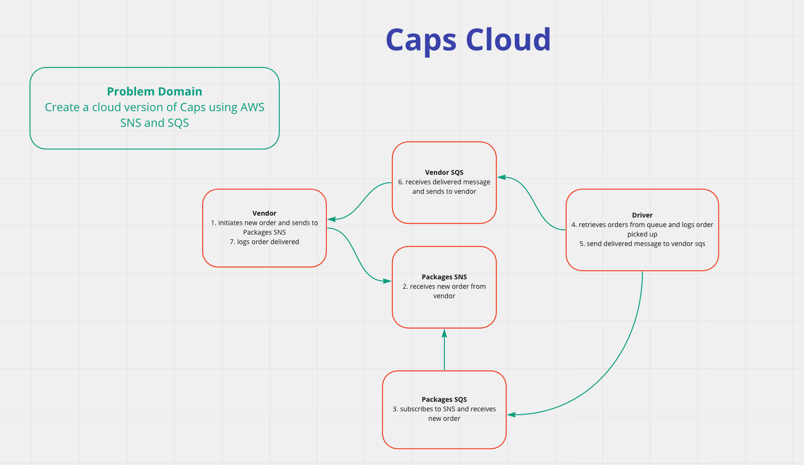
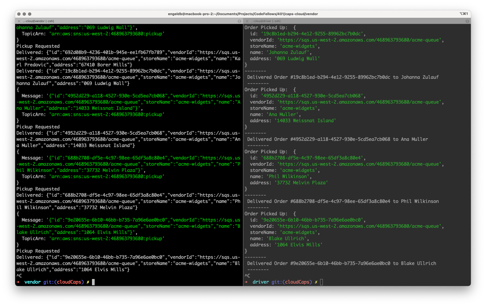

# caps-cloud

## Project Overview

> Create a cloud version of the CAPS project using AWS SNS and SQS.

### Links

[Pull Request](https://github.com/daneng1/caps-cloud/pull/2)

### Requirements

- SNS Topic: pickup which will receive all pickup requests from vendors
- SQS Queue (FIFO): packages which will contain all delivery requests from vendors, in order of receipt.
- Subscribe this queue to the pickup topic so all pickups are ordered
- SQS Queue (Standard) for each vendor (named for the vendor) which will contain all delivery notifications from the drivers

### UML

### Terminal Logs

